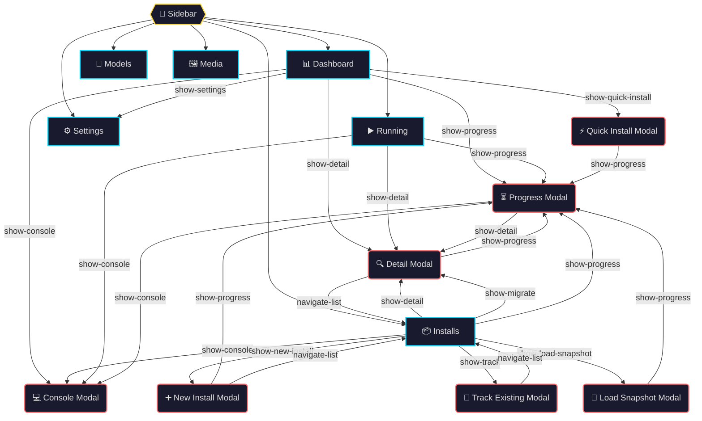

# View/Modal Flow — Desktop 2.0

> Auto-generated by `scripts/generate-view-flow.mjs` — do not edit manually.
>
> Run: `node scripts/generate-view-flow.mjs`

## Navigation Graph

## Legend

- **Blue border** = Tab view (sidebar navigation)
- **Red border** = Modal (overlay)
- **Yellow border** = Sidebar navigator
- Edge labels show the Vue event name that triggers the transition

## Source Files

| View/Modal | Source |
|------------|--------|
| 📊 Dashboard | [`src/renderer/src/views/DashboardView.vue`](../src/renderer/src/views/DashboardView.vue) |
| 📦 Installs | [`src/renderer/src/views/InstallationList.vue`](../src/renderer/src/views/InstallationList.vue) |
| ▶️ Running | [`src/renderer/src/views/RunningView.vue`](../src/renderer/src/views/RunningView.vue) |
| 📁 Models | [`src/renderer/src/views/ModelsView.vue`](../src/renderer/src/views/ModelsView.vue) |
| 🖼️ Media | [`src/renderer/src/views/MediaView.vue`](../src/renderer/src/views/MediaView.vue) |
| ⚙️ Settings | [`src/renderer/src/views/SettingsView.vue`](../src/renderer/src/views/SettingsView.vue) |
| ⚡ Quick Install Modal | [`src/renderer/src/views/QuickInstallModal.vue`](../src/renderer/src/views/QuickInstallModal.vue) |
| 🔍 Detail Modal | [`src/renderer/src/views/DetailModal.vue`](../src/renderer/src/views/DetailModal.vue) |
| 💻 Console Modal | [`src/renderer/src/views/ConsoleModal.vue`](../src/renderer/src/views/ConsoleModal.vue) |
| ⏳ Progress Modal | [`src/renderer/src/views/ProgressModal.vue`](../src/renderer/src/views/ProgressModal.vue) |
| ➕ New Install Modal | [`src/renderer/src/views/NewInstallModal.vue`](../src/renderer/src/views/NewInstallModal.vue) |
| 📂 Track Existing Modal | [`src/renderer/src/views/TrackModal.vue`](../src/renderer/src/views/TrackModal.vue) |
| 📸 Load Snapshot Modal | [`src/renderer/src/views/LoadSnapshotModal.vue`](../src/renderer/src/views/LoadSnapshotModal.vue) |
